# Lab 1 - Freestyle Project

## Part 1: Starting up Jenkins

- For this class, you will be running Jenkins from the `jenkins.war` file.
  - This means that you will have to start Jenkins yourself

### Jenkins Location 

Jenkins maintains its state ad configuration in a directory `.jenkins`
- Deleting this directory effective uninstalls Jenkins from your system so *do not remove or move this directory.*
- Jenkins has already been set up and configured for this class using the Jenkins configuration located at: `C:\Jenkins\.jenkins`
- All the labs have been tested with this specific configuration

### Start up

To use the existing Jenkins installation, you **must** start jenkins using the `start.bat` file in the `C:\Jenkin` directory

```bash
# start.bat
java -DJENKINS_HOME=C:\Jenkins\.jenkins \
 -Dhudson.plugins.git.GitSCM.ALLOW_LOCAL_CHECKOUT=true \
  -jar C:\Jenkins\jenkins.war
```

This file contains two critical start up options.
- The `JENKINS_HOME` option will use the configured Jenkins instance
- The `ALLOW_LOCAL_CHECKOUT` option which will allow you to use local git repositories - the default for Jenkins is to only allow remote repositories

Run the `start.bat` file to start Jenkins. 


Confirm that Jenkins is up and running by looking that the last few lines of output


### Log In

Open the running instance of Jenkins through the WebUI.
- `localhost:8080`

You should see the login screen


Both the Chrome and Edge browsers should have the user id and password autofilled. 

If you need to enter the userid and password manually, the credentials are"
- user: `Student`
- pass: `Pa$$w0rd`

Once you are logged in, you should be at the main screen.

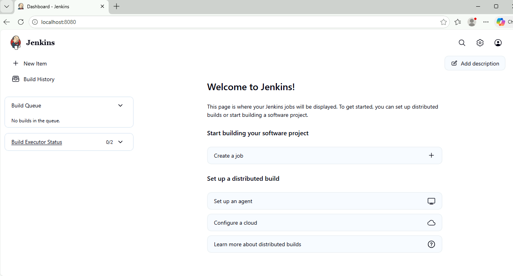


At this point, you are ready to start creating your first Jenkins job.

## Part 2: Create the Project

### Create Item

Select the `+ New Item` on the left top. This brings up the different types of projects that you can create.

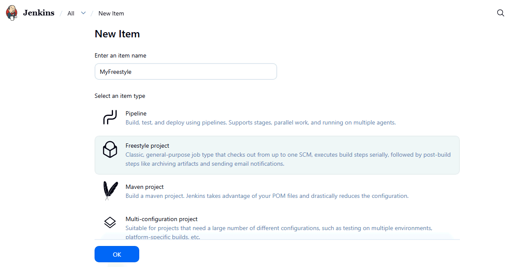

The different project types are provided by the different plugins. For example, the Maven project type is available because the Maven plugin was installed in the Jenkins instance you are using.

### Freestyle Project

Select the `Freestyle project` option and give your project a name. In this case it has been called "MyFreestyle". Then select `OK` to create the project

## Part 3: Configure the Project

The project screen shows a number of configuration sections

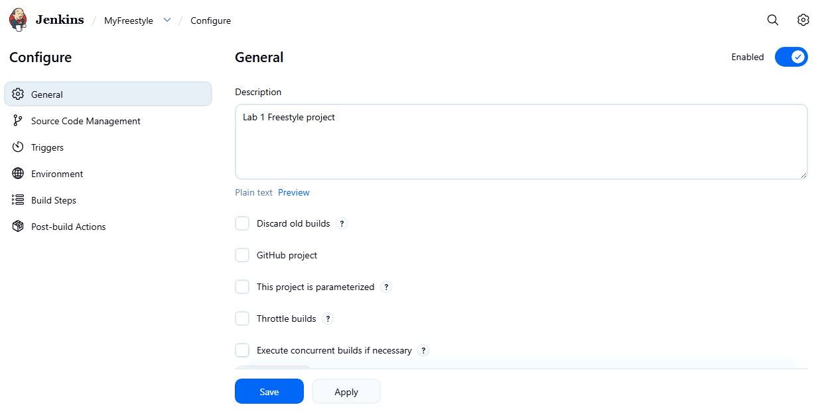


### General 

The first `General` section sets the configuration for how the project is scheduled by Jenkins.

For this lab, we will use the defaults so you don't have to change anything.

However, you should examine each option by clicking the `?` next to the items so you can get an understanding of what each option does.  Make sure you also inspect the `Advanced` features.

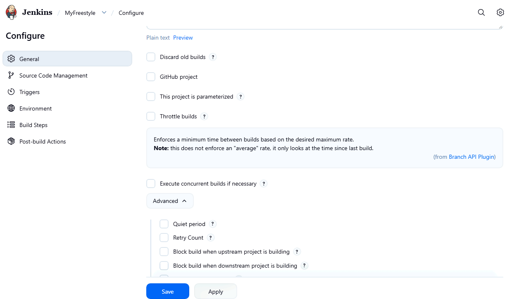

### SCM, Triggers and Environment

We will explore the `SCM` and `Triggers` sections in the next lab. 

We will not be using the `Environment` section in this lab.

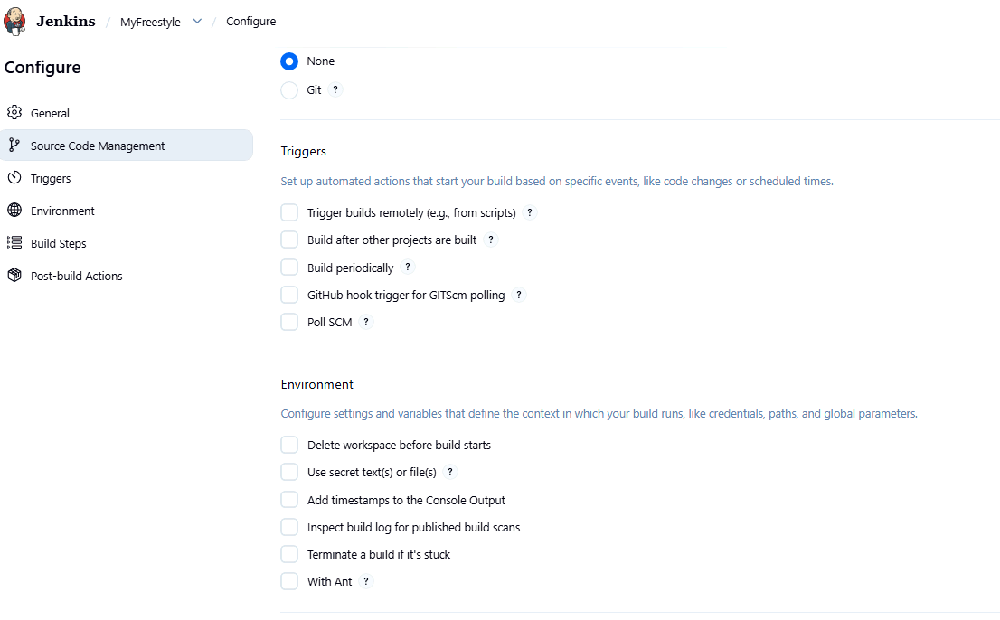

Examine each item using the `?` where it exists in these two sections

### Build Step

This is the step where we will run a simplistic freestyle job.
- All the configuration is being done in the UI. 
- This means that we will not have a history of any changes that are made to the project configuration

For the build step, select the `Add Build Step` feature and choose the `Windows batch command" option.

Enter the command `echo "Hello World"` as shown.

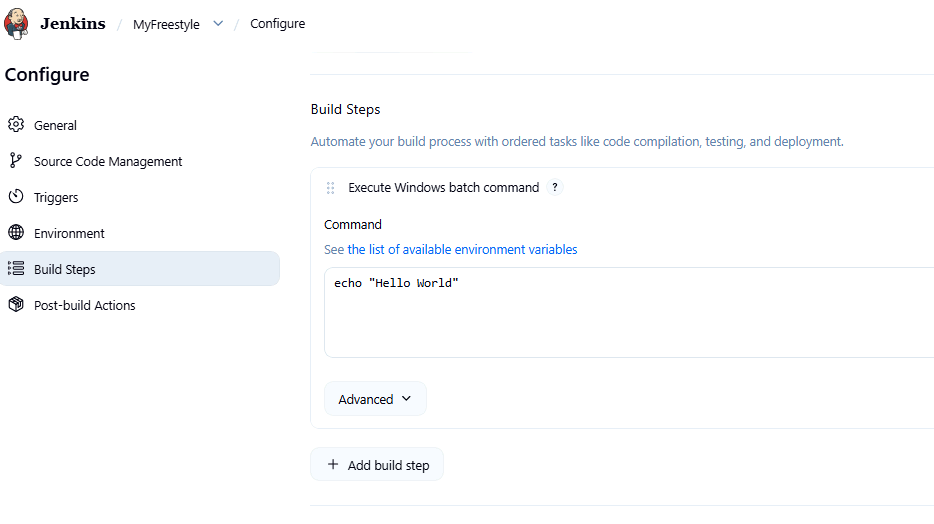

### Post Build Steps

We won't be using these in this lab. Click on the `Add` button to see the options available. Post build actions often come from plugins, usually ones that allow integration with other tools like Slack.

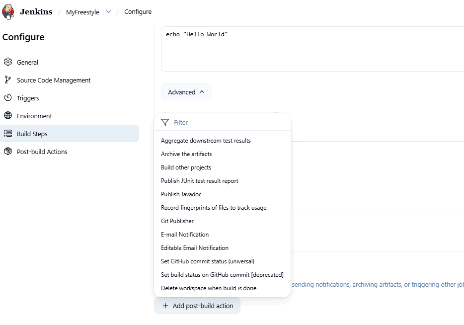


### Finalize

Click on `Save` to create the project.

## Part 3: Running the Build

Once the project is saved, you will be returned to the project screen. 

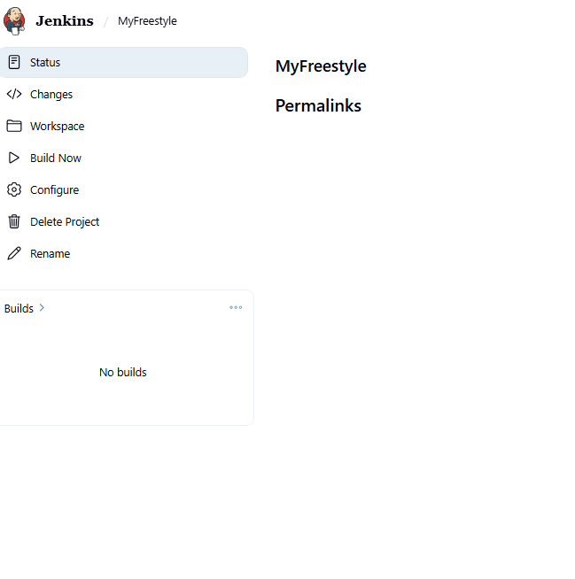

You can return to the previous screen where you configured the project by selecting the `Configure` option.

Run the project by selecting the `Build Now` option.

You should see the first build appear as shown. The green checkmark indicates that the build succeeded.

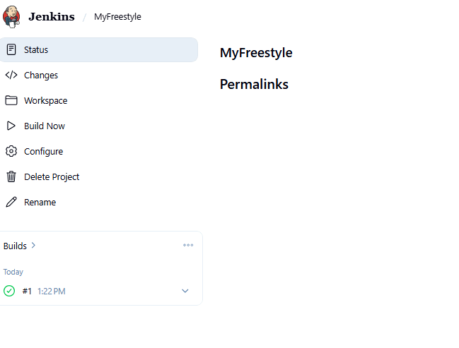

### Examine the Build

Click on the build link with the green checkmark to open the details screen for that build

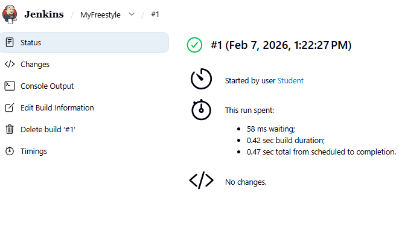


#### Console Output

Selecting the `Console Output` options shows the output of build step on the agent, which in this case is just the controller.

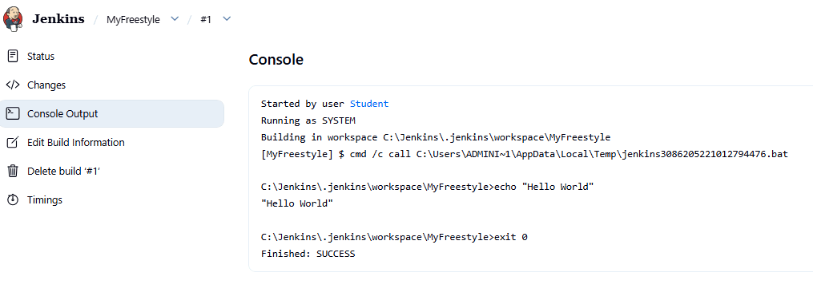


Explore the other options and then return to the main page. The project is now listed in the project queue.

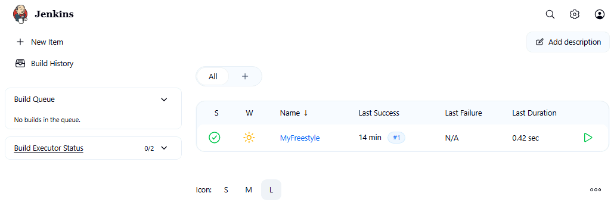

Use the green arrow at the right to run a vew more builds.

Go back to the project page and see the builds recorded on the left.

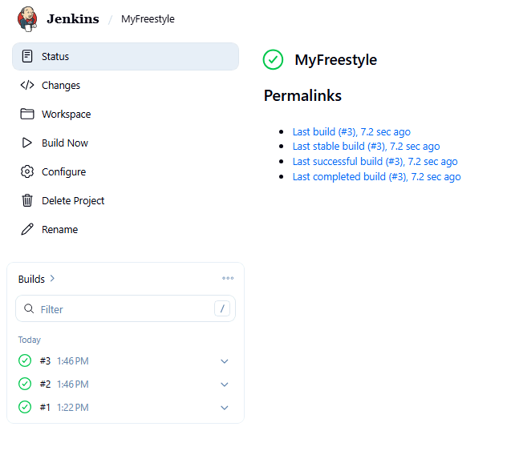


## Part 4: Error Builds

### Introduce an Error

Return to the project configuration screen, open up the build step and misspell the word `echo` to produce an error.

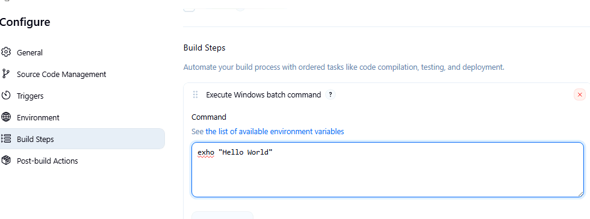

Save and run the project. You should see this build show up as a failed build.

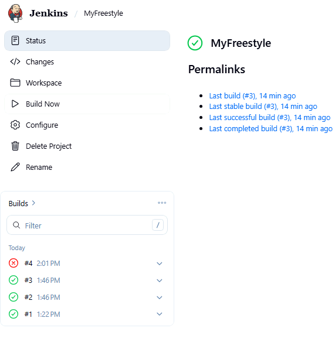

### Examine the output 

Open the screen for the failed build and open the `Console Output` to see the result of the failure.

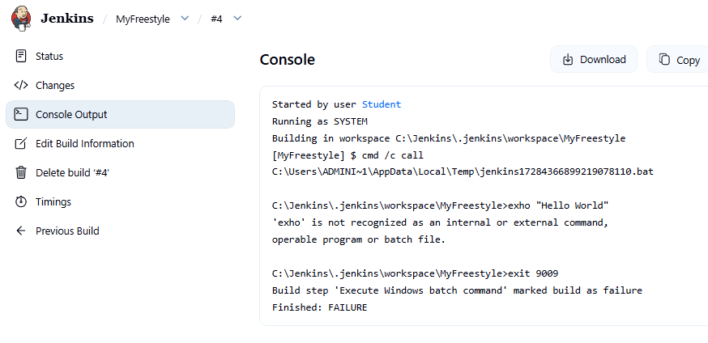


