# Lab 3 - Pipelines

The objective of this lab work is to introduce working with Jenkins pipelines.

Check to see that Jenkins is running and that you are logged in before starting the project.

## Part 1: Create and Run a Simple Pipeline

Go to the main screen and select the `New Item` option. At the project definition screen, select the `Pipeline` option the same way you did for the previous project.


### The Script

Open the configuration screen for the project. Scroll down to the  `Pipeline` section. In the dropdown list on the right, select the `Hello World` script

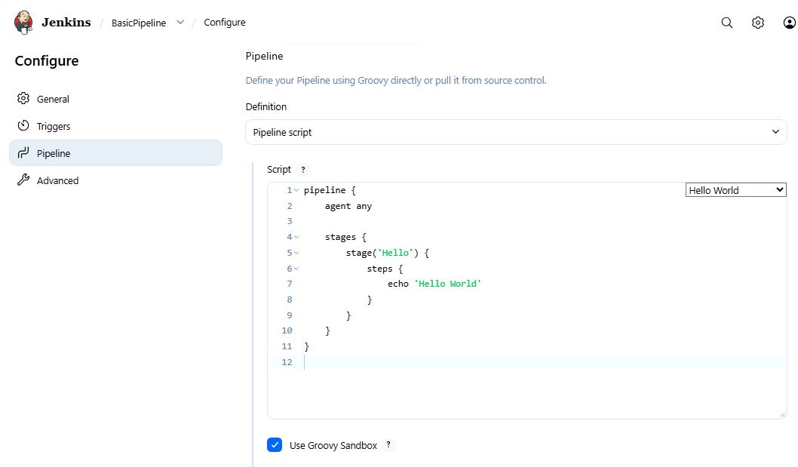

Save the project and run it.

### The Output

Go to the build screen for the build and open the `Consol Output` where you can see the output of the pipeline script

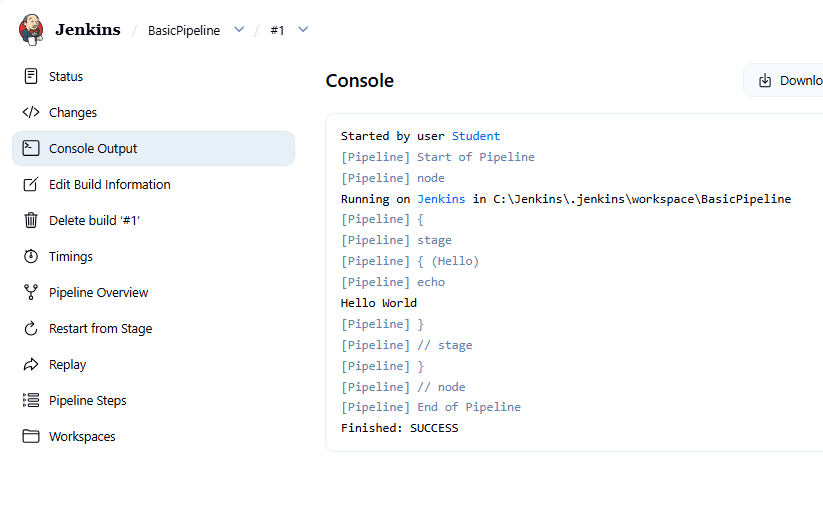

In addition, Jenkins produces an overview of what happened in each stage in the pipeline. Since there is only one stage, there is not much here

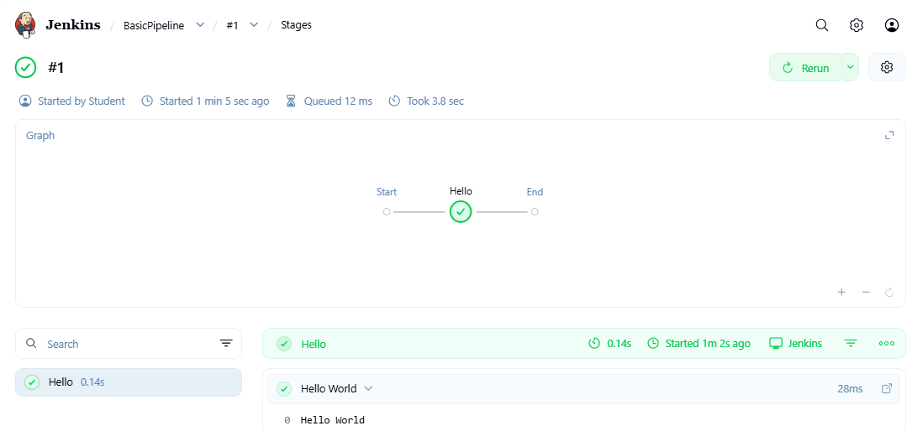


## Part 2: Download the Scripts

For the rest of the lab, you will be working with scripts from repository `https://github.com/ExgnosisClasses/JenkinsFile.git`

Clone this git repository into your lab machine. In this example, it is being cloned into the `C:\repos` directory

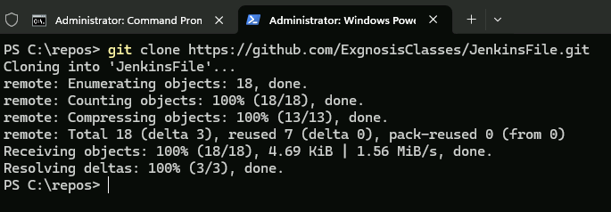

## Part 3: Running a Groovy Script

In this section, you are going to run a Groovy script directly without using a pipeline. The script is in the file `Script` in the repository you just downloaded.

Open the file in an editor. You should see something like this

```java
// Scripted Pipeline (Groovy) example
// Paste into: New Item -> Pipeline -> Pipeline script

def buildLabel = env.BUILD_TAG ?: "unknown"
def targets = ["unit", "integration"]   // demonstrates Groovy list + iteration

node('built-in') {                      // Declarative uses: agent any / agent { label '...' }
    timestamps {
        try {
            stage('Checkout') {
                echo "Build: ${buildLabel}"
                echo "Workspace: ${pwd()}"
                // For demo purposes, just create a file (no SCM required)
                writeFile file: 'README.txt', text: "Hello from Scripted Pipeline!\n"
            }

            stage('Build') {
                echo "Simulating a build..."
                if (isUnix()) {
                    sh 'ls -la'
                } else {
                    bat 'dir'
                }
            }

            stage('Test') {
                // Scripted pipelines use normal Groovy control flow
                for (t in targets) {
                    echo "Running ${t} tests..."
                    if (t == "integration") {
                        // Demonstrate failure handling
                        //echo "Simulating a test failure in integration tests"
                        //error("Integration tests failed (intentional demo)")
                    }
                }
            }

            stage('Archive') {
                archiveArtifacts artifacts: 'README.txt', fingerprint: true
                echo "Artifact archived"
            }

        } catch (err) {
            // Declarative uses: post { failure { ... } }
            currentBuild.result = 'FAILURE'
            echo "Caught error: ${err}"
            throw err

        } finally {
            // Declarative uses: post { always { ... } }
            echo "Always runs (cleanup / notifications)"
        }
    }
}

```

Note that this is not a declarative pipeline definition.


For the pipeline job you just created, remove the existing pipeline code and past the Groovy script into the pipeline definition instead.

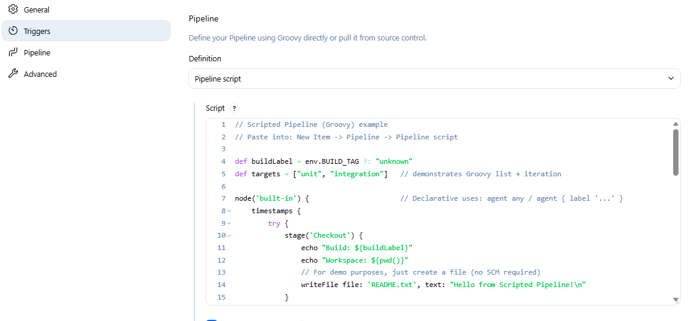

Run the job. It should complete successfully. Check the `pipeline overview` section in the build t see that it ran successfully.

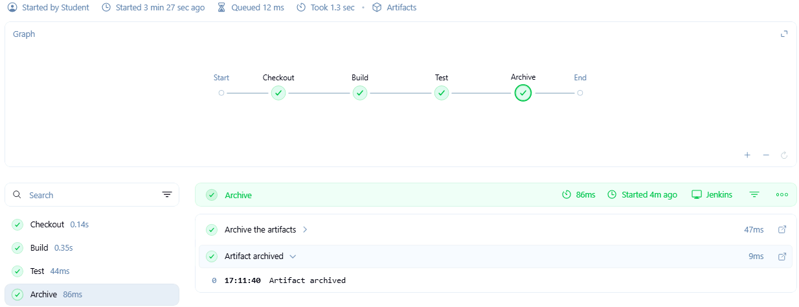

### Introduce an error

Uncomment out these two lines in the script by removing the double slashes. This is going to raise an explicit error condition in the script.  

```java
                     //echo "Simulating a test failure in integration tests"
                     //error("Integration tests failed (intentional demo)")
```
 
Resave the changed script and run it. In the console output you can see the error condition being raised

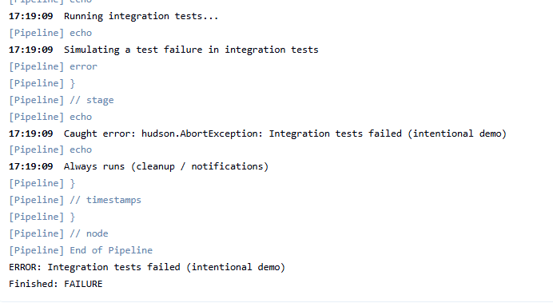

And how it is reported in the pipeine overview


You can delete this job since we are done with it.

## Part 4: Jenkinsfile from SCM

In this section of the lab, you use a Jenkinsfile from the repository you downloaded earlier

Set up a new pipeline project. In the pipeline section, select the option `Pipeline script from SCM`.

Then add the repository and ensure you specify the `main` branch instead of `master`

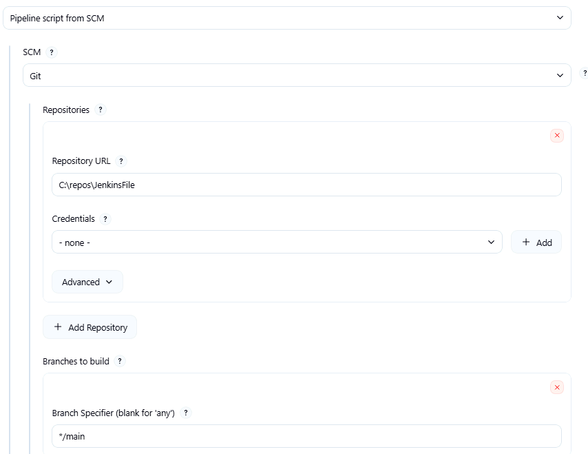

In the `Script Path` put the name of the script to be used in this section `Jenkinsfile0-Hello`

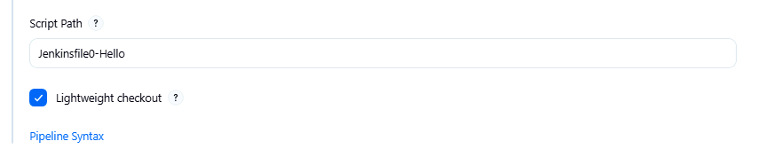

The script that will be executed is:

```bash
pipeline {
    agent any

    stages {
        stage('Hello') {
            steps {
                echo 'Hello World'
            }
        }
        stage('Having a nice time') {
            steps {
                echo 'Are you still here?'
            }
        }
        stage('Goodbye') {
            steps {
                echo 'Get Lost'
            }
        }
    }
}

```

Save, then run the job. Confirm it works by looking at the pipeline overview


## Part 5: Post Stages

Create a new pipeline job exactly the way you did the last one. However, this time use the script file `Jenkinsfile1-Stages` which will load this pipeline code.

```bash
pipeline {
    agent any

    stages {
        stage('Build') {
            steps {
                echo 'Build'
            }
        }
    stage('Unit-Test') {
            steps {
                echo 'Unit Test'
             
                
            }
        }
    stage('Package') {
            steps {
                echo 'Package'
            }
        }
    stage('Deploy') {
            steps {
                echo 'Deploy'
            }
        }
    stage('Report') {
            steps {
                echo 'Report'
            }
        }
    }
    post {
        always {
            echo '++++++++ Always Post build step'
        }
        success {
            echo 'SUCCESS!!!'
        }
        failure {
            echo '***** Failure occured'
        }
        fixed {
            echo '----- Problem Fixed'
        }
        cleanup {
            echo 'Bye from Cleanup'
        }
    }
    
}

```

This defines a straight forward series of stages with several post stages defined. 

Run the code and look at the console output to see the stages that executed and also look at the pipeline overview and the output from each post step

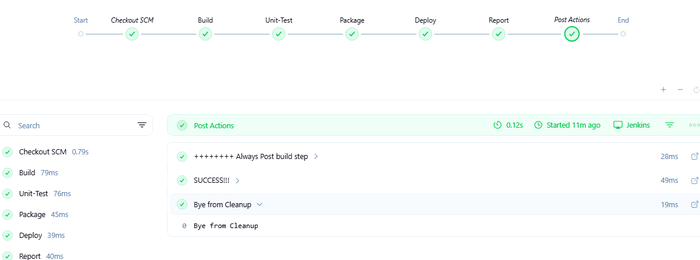

### Post Experiment

In this part of the lab you introduce an error into the `Package` stage by misspelling the word `echo` like we did in a previous lab.

Remember, you will have to check the Jenkinsfile out of the repository, edit it and then commit it back into the repository for the changes to take place.

 
Run the job and see which stages and post stages execute.

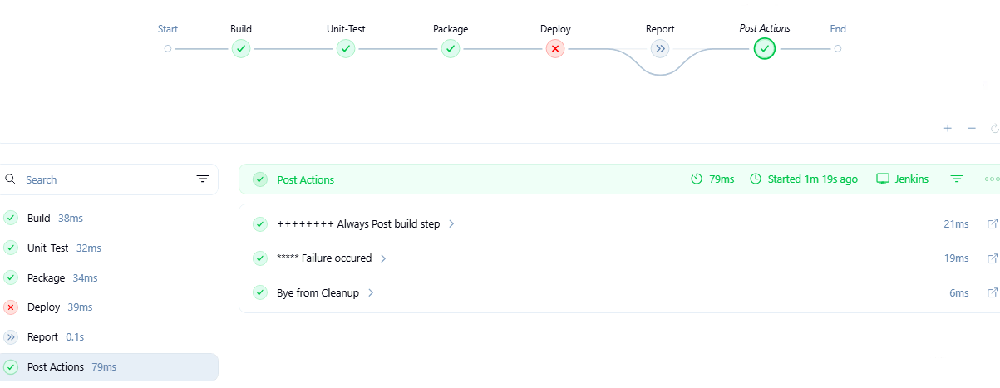

Correct the error then run the job twice more and again compare which post stages execute. See if you can explain the result. Consult the Jenkins documentation online if you need a hint.

First time after correction.


Second time after correction.


## Part 6: Environment Variables

For this and the next section, don't load the pipeline definition from the SCM like we did for the last two sections, but just open the file in a text editor and paste in into the pileline section of the pipeline project.

The first script shows how to access the Jenkins supplied environmental variables

```bash
pipeline {
    agent any
    stages {
        stage('Example') {
            steps {
                echo "Running ${env.BUILD_TAG} on ${env.JENKINS_URL}"
                echo "java ${env.JAVA_HOME}"
            }
        }
    }
}
```

Run this several times and see if you can find out what the values for these variables are.

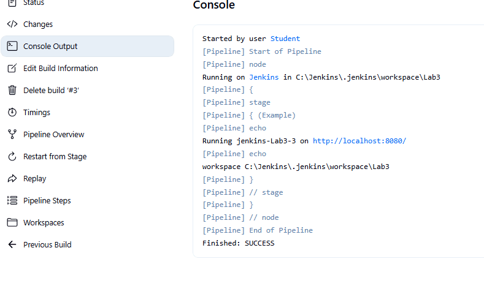

### Conditional Control

Create a new pipeline project using this script which is `Jenkinsfile4-Env2` in the repository

```bash
pipeline {
    agent any
    environment {
        IN_PROD = 'true'
    }
    stages {
        stage('Build') {
            steps {
                echo "Build"
                echo "Value of IN_PROD is ${IN_PROD}"
            }
        }
    stage('Test') {
       
            steps {
                echo 'Test'
                
            }
        }
    stage('Package') {
        when {
            anyOf {
            environment name: "IN_PROD", value: 'true'
            branch 'production'
            }
        }
            steps {
                echo 'Package'
            
            }
        }
    stage('Deploy') {
            steps {
                echo 'Deploy'
            }
        }
    stage('Report') {
            steps {
                echo 'Report'
            }
        }
    }
    
}

```

In this script, the environment variable `IN_PROD` determines if the `Package` stage is build. If there is a `when` clause at the start of a stage, and it evaluates to `true`, the stage executes. Otherwise, the stage is skipped. 

Create a new pipeline project with this code and run it to see all the stages executing. Also check the console output to see the value of the environment variable


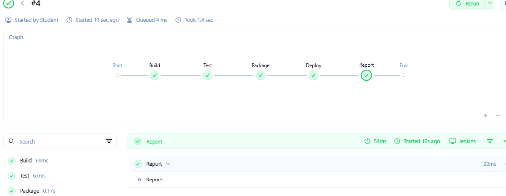

Edit the code to assign the environment variable the value `false`


```bash
pipeline {
    agent any
    environment {
        IN_PROD = 'false'
    }
```

Save the pipeline and rerun it. Look at the pipeline overview to see the stage has now been skipped


## End Lab

