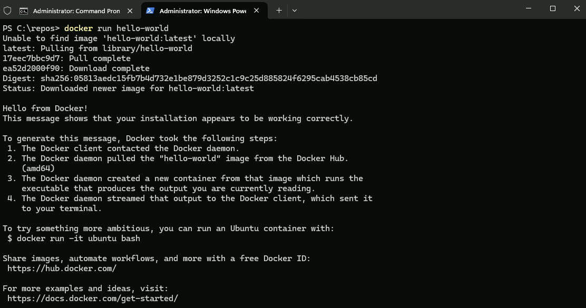
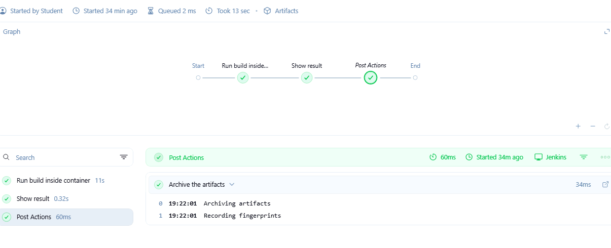
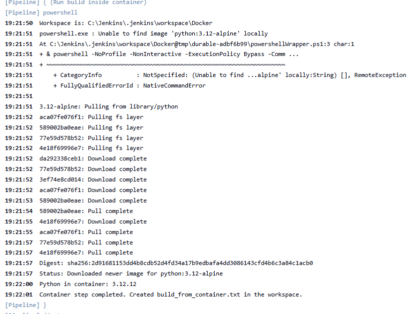
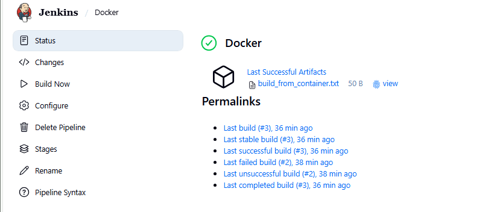

# Lab 4 - Docker Agents

In this lab, you will execute a pipeline but actual stage that executes the build will be done in a docker container.

Docker Desktop is installed on your computer. To do this lab, it must be up and running.  Start it by double-clicking on the icon on the desktop. Give it a few minutes to start up then test it by opening a command window and running a test job.

```bash
docker run hello-world
```

You should see output like this



### The Script

Create a pipeline project and paste the following script into the pipeline script window.


```bash
pipeline {
  agent any

  options {
    timestamps()
  }

  stages {
    
    stage('Run build inside container') {
      steps {
        powershell '''
          $ErrorActionPreference = "Stop"

          # Jenkins workspace path on Windows
          $ws = $env:WORKSPACE

          Write-Host "Workspace is: $ws"

          # Run a Linux container and mount the workspace into /work
          # --mount avoids lots of Windows path quoting problems
          docker run --rm `
            --mount type=bind,source="$ws",target=/work `
            -w /work `
            python:3.12-alpine `
            python -c "import platform,datetime; print('Python in container:', platform.python_version()); open('build_from_container.txt','w').write('Built in container at: ' + str(datetime.datetime.now()) + '\\n')"

          Write-Host "Container step completed. Created build_from_container.txt in the workspace."
        '''
      }
    }

    stage('Show result') {
      steps {
        bat 'type build_from_container.txt'
      }
    }
  }

  post {
    always {
      archiveArtifacts artifacts: 'build_from_container.txt', fingerprint: true
    }
  }
}


```

### The Powershell commands

This is where the work is actually done by the Python container.

PowerShell is:
- Starting a container
- Sharing the Jenkins workspace with it
- Running one simple command inside the container
- Letting Jenkins collect the result

#### Stop immediately if anything fails

`$ErrorActionPreference = "Stop"`

- Tells PowerShell: if any command fails, stop the build
- Prevents “half-successful” builds
- Makes failures obvious to user

#### Read Jenkins’ workspace location

`$ws = $env:WORKSPACE`

- Jenkins sets WORKSPACE automatically
- This is the folder where:
  - Jenkins checked out the code 
  - Build files should be written
- We store it in $ws for reuse

#### Print the workspace path (for debugging)

`Write-Host "Workspace is: $ws"`
- Helpful for understanding how files move between Jenkins and containers

#### Start a Docker container

`docker run --rm --mount type=bind,source="$ws",target=/work ...`

- `docker run` starts a container
- `--rm` means delete the container automatically when done
  - Keeps the system clean (no leftover containers)
- `--mount` Mounts the Jenkins workspace into the container
- Shares a Windows folder with the container
- Inside the container:
- /work maps to Jenkins’ workspace
  - Anything written to /work appears back in Jenkins
- `-w /work` Sets the container's working directory
  - Makes /work the “current folder” inside the container
  - Commands run as if Jenkins were “inside” the workspace

`docker ... python:3.12-alpine `
- Uses a small Linux image with Python preinstalled
  - No Python needs to exist on the Windows machine 
#### Run a simple command inside the container

`python -c "import platform,datetime; print('Python in container:', platform.python_version()); open('build_from_container.txt','w').write('Built in container at: ' + str(datetime.datetime.now()) + '\n')"`

- Inside the container, this does three things:
  - Prints the Python version (proves it’s running in the container)
  - Creates a file named build_from_container.txt
  - Writes the current date/time into the file
- Because /work is mounted, that file appears in Jenkins’ workspace.

#### Confirm completion

`Write-Host "Container step completed. Created build_from_container.txt in the workspace."`

- Just a friendly message so students know the container step finished

### Run the pipeline

The pipeline overview should look like this



In the console output you can see Docker pulling and using the container



And finally, you can see the output file for the build, open it and confirm it is correct.



## End Lab