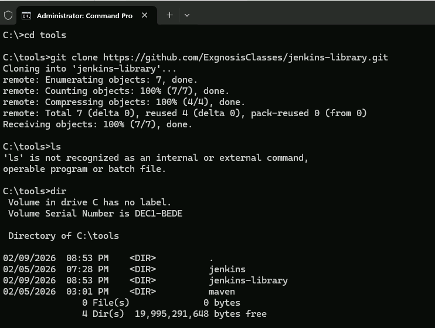
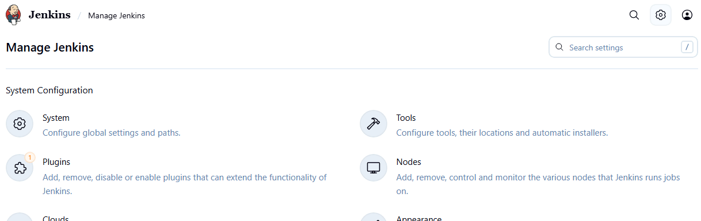
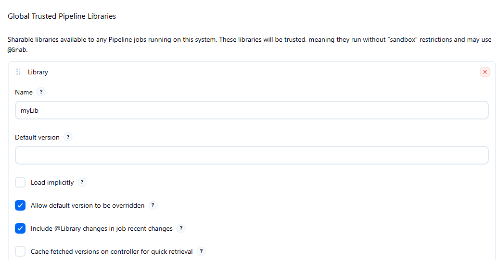
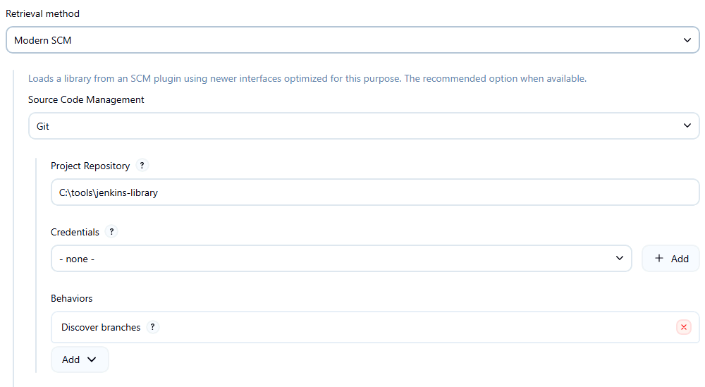
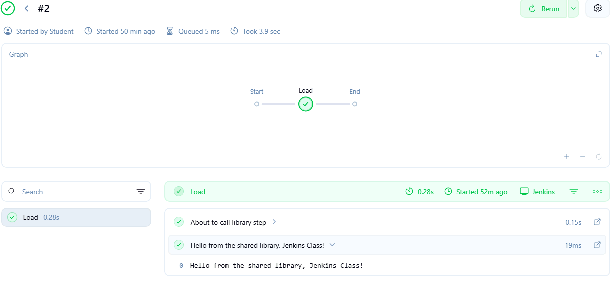

# Lab 5 - Jenkins Libraries

In this lab, you will all a Groovy function from a Jenkins library from a pipeline.

## Part 1: Install the library

For this step, all you have to do is clone the library to your local machine from here

[https://github.com/ExgnosisClasses/jenkins-library.git](https://github.com/ExgnosisClasses/jenkins-library.git)

For this step, to be consistent with the screenshots that follow, clone it into the `C:\tools` directory on the lab machine



The library is quite simple, just a simple one line function in the `vars` directory, which means that it is callable as a pipeline step

```java

// hello.groovy

def call(String name = "World") {
    echo "Hello from the shared library, ${name}!"
}
```

## Part 2: Configuring Jenkins

Jenkins has to know where to find the library. Open up the configuration window by using the cog wheel icon in the top right of the Jenkins main window to go the configuration area.



Select the option `System - configure global settings and paths` located under the `System Configuration` section.

Scroll down until you find the section labeled `Global Trusted Pipelne Libraries` Select the `Add` button and provide the name of the library `jenkins-library` and the branch of the repo to use, in this case `main`



Scroll down a bit further under `Retrieval Method`, and add the information about the location of the repository that holds the library code



Select `Save` and the library is configured.

## Part 3: Create the script

Create a new Jenkins pipeline project and add this script. 

Don't forget to add the trailing underscore to the `@Library('jenkins-library') _` line


```bash
@Library('jenkins-library') _

pipeline {
    agent any
    stages {
        stage('Library Step Demo') {
            steps {
                echo "About to call library step..."
                hello("Windows 11 class")
            }
        }
    }
}

```

The first line tells the script which library to use.

In the steps section, notice that the `hello.groovy` function is now step that can be executed. 

## Part 4: Run the Script

Execute the script and examine the pipeline overview. Confirm that you can see the output of the Groovy function call.



Also check the console output to see the library being loaded at the start of the script


## End Lab